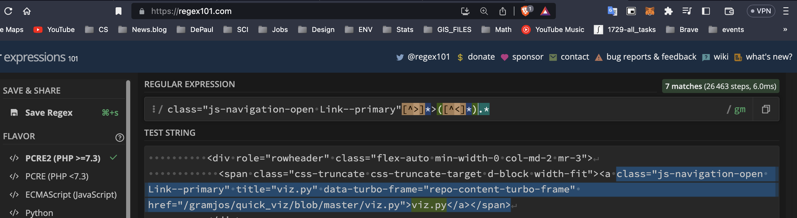

### Scraping Github with Bash 
Given the file `reposFiles.sh` and its two parameters **[Github Username] [Repository Name]** display the contents of the repository. <br>
- The graphic below assumes: 
  - the file is executable 
  - in current directoy
  - There is a Github user named gramjos
  - This Github user has a *Public* Repository called tour_co
<p align="center">
  
</p>
Friendly usage statment displayed when arguments are inadequate. 
<p align="center">
  
</p>

#### Below is the entirity of the script

```shell
#!/usr/bin/env zsh

usage_statement(){
	USAGE=$(cat <<-END
░░░░  this program needs two args   ░░░░
    Usage Statement
$ ./reposFiles [GitHub Username] [Repository Name]
END
)
	printf "%s\n" $USAGE;
}

if [[ "$#" != 2 ]]; then
	usage_statement;
	exit 1;
fi

curl -s "https://github.com/"$1"/"$2 |\
	awk -F">|<"	'$0 ~ /class="js-navigation-open Link--primary"/ {print $5}';

```

##### When the awk command recives the raw HTML
The nature of `awk` is a line by line parser. So question becomes, what sequence of characters can be searched for that is uniquely shared between the desired lines. The desired lines have directory and file information that will be eventually printed to the screen.<br>
Within the single quotes in the command below, sets up a regular expression matching of the pattern between the forward slashes. `$0` repersents the whole line and the tilde `~` operator specifies regular expression matching. As `awk` takes its inputs, it is searching for the exact string `class="js-navigation-open Link--primary"` <br>
`-F` flag for field separator pattern
```shell
awk -F">|<"	'$0 ~ /class="js-navigation-open Link--primary"/ {print $5}';

```

The block of HTML below is an example of a  successful match. A successful match outputs the entire line. The line is then delineated by the specified field separator. The fifth field contains the sought after data.

```shell
<a class="js-navigation-open Link--primary" title="ABOUTS" data-pjax="#repo-content-pjax-container" data-turbo-frame="repo-content-turbo-frame" href="/gramjos/vopen/blob/master/ABOUTS">ABOUTS</a>
```

The image below, demonstrates how to capture the inner HTML of tags that contain the unique class that is shared between the sought after data.



